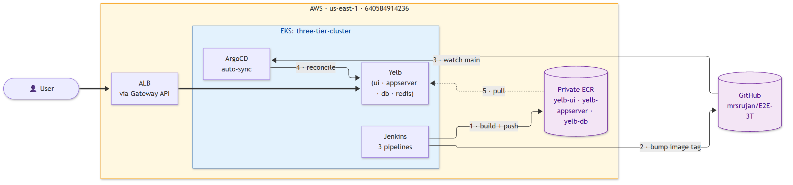

# E2E-3T — Three-Tier App on EKS with GitOps

Deploy the **Yelb** 3-tier app on AWS EKS. CI via Jenkins (in-cluster), CD via ArgoCD, ingress via Gateway API. Infrastructure as Code via Terraform (3 layered modules).

## Deployment paths

Two complete, step-by-step deployment guides are in [`docs/`](docs/):

| Path                                               | When to use                                                                                 |
|----------------------------------------------------|---------------------------------------------------------------------------------------------|
| [docs/deploy-terraform.md](docs/deploy-terraform.md) | **Recommended.** Fully automated: `./bootstrap.sh && ./apply-all.sh` and you're done.       |
| [docs/deploy-manual.md](docs/deploy-manual.md)       | Learning / audit path. Uses the AWS Console wherever possible; CLI only when console can't. |

## Repository layout

```
E2E-3T/
├── Application-Code/            # Yelb source (forked from mreferre/yelb)
│   ├── yelb-ui/                 # Angular + nginx
│   ├── yelb-appserver/          # Ruby + Sinatra
│   └── yelb-db/                 # Postgres image with seed SQL
├── Kubernetes-Manifests-file/   # Deployed by ArgoCD
│   ├── UI/                      # Deployment + Service + HTTPRoute
│   ├── Appserver/               # Deployment + Service
│   ├── DB/                      # StatefulSet + headless Service (EBS gp3 PVC)
│   └── Redis/                   # Deployment + Service (upstream redis:7.2-alpine)
├── Jenkins-Pipeline-Code/       # One Jenkinsfile per buildable component
│   ├── Jenkinsfile-UI
│   ├── Jenkinsfile-Appserver
│   └── Jenkinsfile-DB
├── Jenkins/
│   └── jenkins-values.yaml      # Helm values for in-cluster Jenkins
├── terraform/                   # 3-layer IaC
│   ├── foundation/              # VPC, EKS, nodegroup, ECR, IRSA OIDC
│   ├── cluster-addons/          # EBS CSI, ALB controller, Jenkins, ArgoCD
│   └── gateway/                 # Gateway API CRDs + Gateway resource
└── docs/
    ├── deploy-terraform.md
    └── deploy-manual.md
```

## Architecture



High-level + detailed diagrams with narration: **[docs/architecture.md](docs/architecture.md)**.

ASCII quick-glance:

```
                       ┌─────────────────────────────────────┐
   Internet ──▶ ALB ──▶│  EKS cluster (private subnets)      │
                       │                                     │
                       │  ns: three-tier                     │
                       │   ├─ yelb-ui       (Deployment)     │
                       │   ├─ yelb-appserver(Deployment)     │
                       │   ├─ yelb-db       (StatefulSet+EBS)│
                       │   └─ redis-server  (Deployment)     │
                       │                                     │
                       │  ns: argocd   — reconciles manifests│
                       │  ns: jenkins  — builds, pushes ECR  │
                       └─────────────────────────────────────┘
                                  │                 │
                                  ▼                 ▼
                             Private ECR       GitHub (this repo)
```

**Flow:** Jenkins builds image → pushes to ECR → bumps image tag in Git → ArgoCD detects change → syncs to cluster.

## Quickstart (Terraform path)

```bash
# One-time: provision S3 + DynamoDB for Terraform remote state
cd terraform && ./bootstrap.sh

# Copy and edit terraform.tfvars in each layer
for d in foundation cluster-addons gateway; do
  cp $d/terraform.tfvars.example $d/terraform.tfvars
done

# Apply all layers (foundation ~15 min, addons ~5 min, gateway ~2 min)
./apply-all.sh

# Configure kubectl and verify
aws eks update-kubeconfig --region us-east-1 --name three-tier-cluster
kubectl get nodes
kubectl -n argocd get applications
kubectl -n three-tier get pods
```

See [docs/deploy-terraform.md](docs/deploy-terraform.md) for the full guide including Jenkins wiring, teardown order, and troubleshooting.

## Prerequisites

- AWS account + IAM user with `AdministratorAccess` for initial apply
- Local tools: AWS CLI 2.15+, Terraform 1.6+, kubectl 1.28+, Helm 3.12+
- A region with EKS (this project defaults to `us-east-1`)

## Notes

- **Jenkins has moved in-cluster.** The old `Jenkins-Server-TF/` (standalone EC2) is **deprecated** — delete it once you've migrated.
- **`ingress.yaml` is gone.** Routing is now Gateway API (`Gateway` in `terraform/gateway/`, `HTTPRoute` in `Kubernetes-Manifests-file/UI/`).
- **MongoDB is gone.** The old app was React + Node + Mongo; Yelb uses Postgres + Redis.
- ArgoCD Applications default to the branch `main` of `https://github.com/mrsrujan/E2E-3T.git`. Fork it and change `argocd_repo_url` in `terraform/cluster-addons/terraform.tfvars`.

## Cleanup

```bash
cd terraform && ./destroy-all.sh
```

The script tears down layers in reverse dependency order. See the "Teardown" section in `docs/deploy-terraform.md` for the console checklist of common leaks (orphaned ALBs, EBS volumes, SGs).
