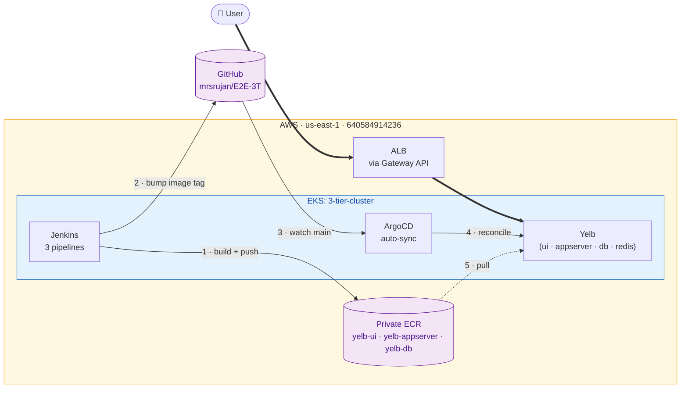
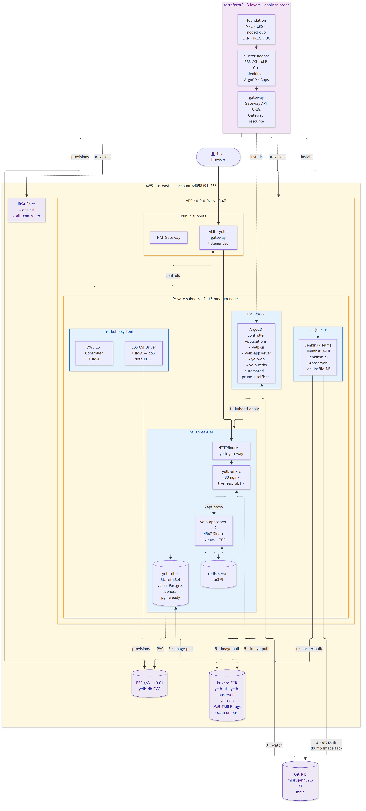
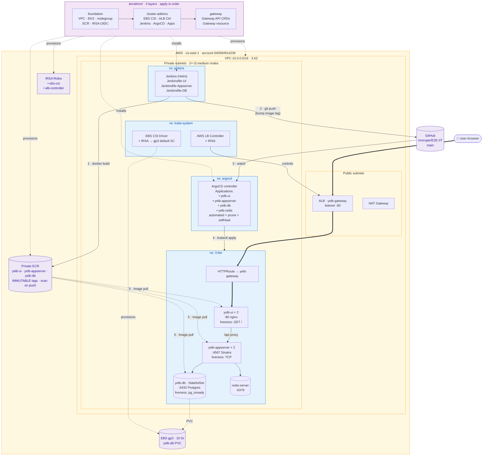

# Architecture

Two views of the same system. **High-level** for a 10-second overview; **detail** when you need to debug or plan a change.

Both diagrams are kept as Mermaid sources in `assets/architecture-*.mmd` so they're text-diffable in PRs. GitHub renders them inline below.

> The historical GIF from the upstream fork is at [`assets/legacy-3-tier.gif`](../assets/legacy-3-tier.gif) — it describes the pre-migration stack (React + Node + Mongo on EC2-hosted Jenkins) and is kept for reference only.

---

## 1 · High-level

What runs where, and how traffic + GitOps loop flow. Zero infrastructure detail.


<details>
<summary>Mermaid source (rendered above)</summary>



</details>

**The 5 numbered steps are the GitOps loop:**
1. Jenkins builds the image and pushes to ECR.
2. Jenkins commits an image-tag bump into the manifests repo on GitHub.
3. ArgoCD (polling or webhook) detects the commit on `main`.
4. ArgoCD reconciles — applies the new manifest to the cluster.
5. Kubelet pulls the new image from ECR.

User requests go `→ ALB → yelb-ui → yelb-appserver → yelb-db + redis`. No step bypasses GitOps once the cluster is up.

---

## 2 · Detail

Terraform layers, namespaces, service ports, probes, IRSA, PVC. Everything a reviewer or on-call needs to debug the system.



<details>
<summary>Mermaid source (rendered above)</summary>



</details>

### Reading the detail diagram

- **Thick arrows (`==>`)** = user data plane, request path.
- **Thin arrows (`-->`)** = control plane / service-to-service.
- **Dotted arrows (`-.->`)** = provisioning or passive relationships (TF creates resource; kubelet pulls image).
- **Numbered edges 1–5** = the GitOps + image pull loop (same as the high-level view, expanded).

### Resources per Terraform layer

| Layer            | What it creates                                                                                                          |
|------------------|---------------------------------------------------------------------------------------------------------------------------|
| `foundation/`    | VPC (3 AZ), EKS 1.28, managed nodegroup (2× t3.medium), 3 ECR repos, IAM OIDC provider for IRSA                           |
| `cluster-addons/`| EBS CSI driver (addon + IRSA + gp3 StorageClass), ALB Controller (Helm + IRSA), Jenkins (Helm), ArgoCD (Helm + 4 Apps)    |
| `gateway/`       | Gateway API CRDs (Helm), the `yelb-gateway` resource                                                                       |

### Re-rendering the PNGs

The PNGs in `assets/` are generated from the `.mmd` source files via `mermaid-cli`. To regenerate after an edit:

```bash
# First time only — Puppeteer needs a Chromium:
npx -y puppeteer@latest browsers install chrome

# Point mmdc at the installed Chrome (path varies by OS):
cat > /tmp/.puppeteer.json <<EOF
{ "executablePath": "C:\\\\Users\\\\<you>\\\\.cache\\\\puppeteer\\\\chrome\\\\win64-154.0.8037.57\\\\chrome-win64\\\\chrome.exe",
  "args": ["--no-sandbox"] }
EOF

# Render:
npx -y @mermaid-js/mermaid-cli@latest -i assets/architecture-high-level.mmd -o assets/architecture-high-level.png -b white -s 3 -p /tmp/.puppeteer.json
npx -y @mermaid-js/mermaid-cli@latest -i assets/architecture-detail.mmd    -o assets/architecture-detail.png    -b white -s 3 -p /tmp/.puppeteer.json
```

On Linux/macOS, point `executablePath` at your system Chromium/Chrome, or install via puppeteer and use the path it prints.

If you only need the diagrams rendered inside GitHub, you don't need to regenerate PNGs — the Mermaid code fences in this file render natively.
